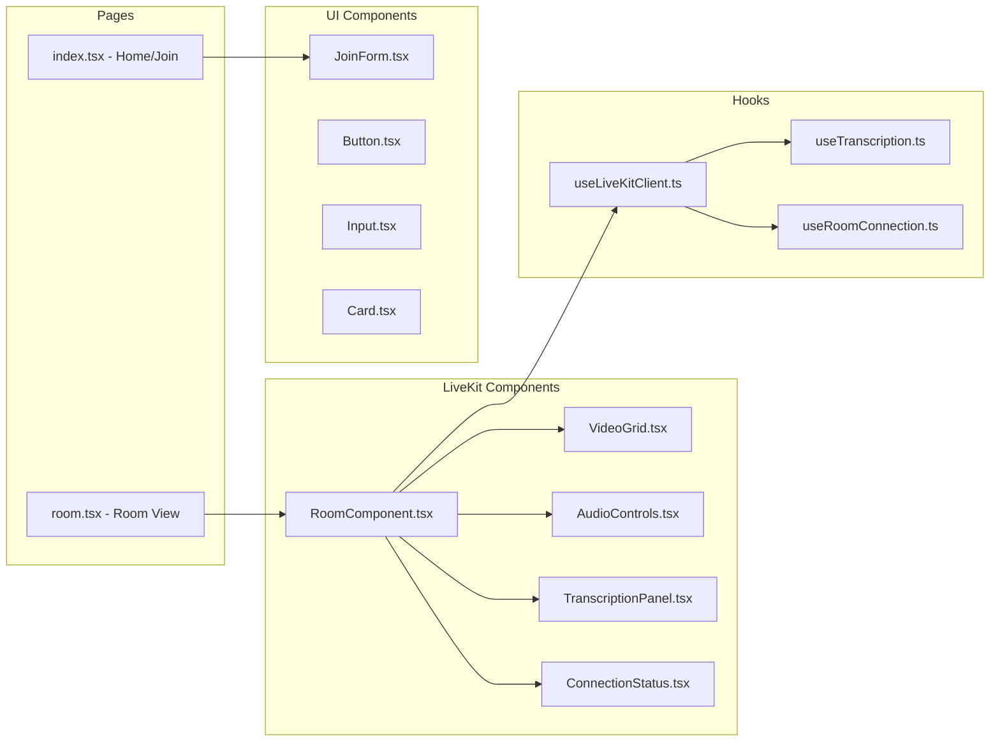

# Design Document: LiveKit Web Frontend

## Overview

The LiveKit Web Frontend is a React/Next.js application that provides a professional web interface for real-time video conferencing and agent interaction using the LiveKit platform. The application is based on the LiveKit Sandbox UI design and leverages official LiveKit React components and SDK for core functionality.

The system architecture follows a component-based design with clear separation between:
- **Presentation Layer**: React components for UI rendering
- **Connection Layer**: LiveKit SDK integration for room management
- **State Management Layer**: React hooks and context for application state
- **Configuration Layer**: Environment-based configuration management

The application will be deployable to multiple platforms (Vercel, Netlify, custom VPS) and will support both development and production environments with appropriate security measures.

## Architecture

### High-Level Architecture

```mermaid
graph TB
    subgraph "Browser Client"
        UI[UI Components]
        Hooks[Custom Hooks]
        LiveKitComponents[@livekit/components-react]
        LiveKitClient[livekit-client SDK]
    end
    
    subgraph "Next.js Server"
        API[API Routes]
        TokenGen[Token Generator]
        EnvConfig[Environment Config]
    end
    
    subgraph "LiveKit Cloud"
        LiveKitServer[LiveKit Server]
        Agent[Python Agent Backend]
    end
    
    UI --> Hooks
    UI --> LiveKitComponents
    Hooks --> LiveKitClient
    LiveKitComponents --> LiveKitClient
    LiveKitClient --> LiveKitServer
    UI --> API
    API --> TokenGen
    TokenGen --> EnvConfig
    LiveKitServer --> Agent
    Agent --> LiveKitServer
```

### Component Architecture



## Components and Interfaces

### 1. Room Connection Components

#### RoomComponent
Primary container component for the room view.

```typescript
interface RoomComponentProps {
  roomName: string;
  participantName: string;
  token: string;
  serverUrl: string;
}

interface RoomState {
  isConnected: boolean;
  connectionError: string | null;
  participants: Participant[];
  localParticipant: LocalParticipant | null;
}

// Component manages room lifecycle and renders child components
const RoomComponent: React.FC<RoomComponentProps> = (props) => {
  // Uses LiveKit's LiveKitRoom component from @livekit/components-react
  // Wraps VideoGrid, AudioControls, TranscriptionPanel, ConnectionStatus
}
```

#### useLiveKitClient Hook
Custom hook for managing LiveKit room connection.

```typescript
interface UseLiveKitClientOptions {
  roomName: string;
  participantName: string;
  token: string;
  serverUrl: string;
}

interface UseLiveKitClientReturn {
  room: Room | null;
  isConnecting: boolean;
  isConnected: boolean;
  error: Error | null;
  connect: () => Promise<void>;
  disconnect: () => Promise<void>;
}

function useLiveKitClient(options: UseLiveKitClientOptions): UseLiveKitClientReturn {
  // Manages Room instance from livekit-client
  // Handles connection lifecycle
  // Provides connection state and error handling
}
```

#### useRoomConnection Hook
Hook for managing connection state and reconnection logic.

```typescript
interface UseRoomConnectionReturn {
  connectionState: ConnectionState;
  reconnecting: boolean;
  handleReconnect: () => void;
}

function useRoomConnection(room: Room | null): UseRoomConnectionReturn {
  // Monitors room.state changes
  // Handles reconnection attempts
  // Provides connection status
}
```

### 2. Video Display Components

#### VideoGrid
Displays video feeds from all participants in a responsive grid.

```typescript
interface VideoGridProps {
  participants: Participant[];
  localParticipant: LocalParticipant | null;
}

interface VideoTileData {
  participant: Participant;
  videoTrack: RemoteVideoTrack | LocalVideoTrack | null;
  audioTrack: RemoteAudioTrack | LocalAudioTrack | null;
  isMuted: boolean;
  isLocal: boolean;
}

const VideoGrid: React.FC<VideoGridProps> = (props) => {
  // Maps participants to VideoTileData
  // Renders grid layout using CSS Grid
  // Uses ParticipantTile from @livekit/components-react
}
```

#### ParticipantTile (using @livekit/components-react)
Individual video tile for each participant.

```typescript
// Uses VideoTrack component from @livekit/components-react
// Displays participant name overlay
// Shows audio mute indicator
// Handles video disabled state with placeholder
```

### 3. Audio Control Components

#### AudioControls
Provides mute/unmute controls for local audio.

```typescript
interface AudioControlsProps {
  localParticipant: LocalParticipant | null;
}

interface AudioState {
  isMuted: boolean;
  isEnabled: boolean;
  hasPermission: boolean;
}

const AudioControls: React.FC<AudioControlsProps> = (props) => {
  // Manages local audio track state
  // Provides toggle mute functionality
  // Displays current mute status
  // Handles permission errors
}
```

### 4. Transcription and Agent Interaction Components

#### TranscriptionPanel
Displays real-time transcriptions and agent messages.

```typescript
interface TranscriptionPanelProps {
  room: Room | null;
}

interface TranscriptionMessage {
  id: string;
  speaker: string;
  text: string;
  timestamp: Date;
  isAgent: boolean;
}

const TranscriptionPanel: React.FC<TranscriptionPanelProps> = (props) => {
  // Subscribes to data messages from room
  // Parses transcription data from agent
  // Renders message list with auto-scroll
  // Distinguishes between user and agent messages
}
```

#### useTranscription Hook
Hook for managing transcription data from LiveKit data channel.

```typescript
interface UseTranscriptionReturn {
  messages: TranscriptionMessage[];
  addMessage: (message: TranscriptionMessage) => void;
  clearMessages: () => void;
}

function useTranscription(room: Room | null): UseTranscriptionReturn {
  // Listens to room.on('dataReceived') events
  // Parses transcription data format
  // Maintains message history
  // Provides message management functions
}
```

### 5. Room Join Components

#### JoinForm
Form component for entering room credentials.

```typescript
interface JoinFormProps {
  onJoin: (credentials: RoomCredentials) => void;
}

interface RoomCredentials {
  roomName: string;
  participantName: string;
  serverUrl?: string;
}

interface FormState {
  roomName: string;
  participantName: string;
  serverUrl: string;
  errors: Record<string, string>;
  isSubmitting: boolean;
}

const JoinForm: React.FC<JoinFormProps> = (props) => {
  // Manages form state
  // Validates required fields
  // Calls token generation API
  // Navigates to room on success
}
```

### 6. API Routes and Token Generation

#### /api/token
Next.js API route for generating LiveKit access tokens.

```typescript
interface TokenRequest {
  roomName: string;
  participantName: string;
}

interface TokenResponse {
  token: string;
  serverUrl: string;
}

// POST /api/token
async function handler(req: NextApiRequest, res: NextApiResponse<TokenResponse>) {
  // Validates request body
  // Loads API key and secret from environment
  // Generates AccessToken using livekit-server-sdk
  // Returns token and server URL
}
```

#### Token Generator Utility

```typescript
interface GenerateTokenOptions {
  roomName: string;
  participantName: string;
  apiKey: string;
  apiSecret: string;
}

function generateLiveKitToken(options: GenerateTokenOptions): string {
  // Creates AccessToken instance
  // Sets room name and participant identity
  // Grants necessary permissions (canPublish, canSubscribe)
  // Returns signed JWT token
}
```

### 7. Configuration Management

#### Environment Configuration

```typescript
interface EnvironmentConfig {
  LIVEKIT_API_KEY: string;
  LIVEKIT_API_SECRET: string;
  LIVEKIT_URL: string;
  NEXT_PUBLIC_LIVEKIT_URL: string;
}

function loadEnvironmentConfig(): EnvironmentConfig {
  // Loads from process.env
  // Validates required variables
  // Throws error if missing required config
  // Returns typed config object
}
```

## Data Models

### Participant Data Model

```typescript
// Uses Participant type from livekit-client
interface ParticipantData {
  identity: string;
  name: string;
  isSpeaking: boolean;
  isMuted: boolean;
  videoEnabled: boolean;
  audioEnabled: boolean;
  isLocal: boolean;
}
```

### Room State Model

```typescript
interface RoomStateData {
  name: string;
  connectionState: ConnectionState; // from livekit-client
  participants: Map<string, Participant>;
  localParticipant: LocalParticipant | null;
  metadata: string | null;
}
```

### Transcription Data Model

```typescript
interface TranscriptionData {
  messages: TranscriptionMessage[];
  lastUpdated: Date;
}

interface TranscriptionMessage {
  id: string;
  speaker: string;
  text: string;
  timestamp: Date;
  isAgent: boolean;
  isFinal: boolean; // for interim vs final transcriptions
}
```

## Correctness Properties

*A property is a characteristic or behavior that should hold true across all valid executions of a system—essentially, a formal statement about what the system should do. Properties serve as the bridge between human-readable specifications and machine-verifiable correctness guarantees.*


### Property 1: Connection State Consistency
*For any* valid room credentials (room name, participant name, server URL), when a connection is established, the UI connection status should display "Connected", and when disconnected, all resources should be cleaned up and the UI should display disconnected state.
**Validates: Requirements 1.1, 1.2, 1.5**

### Property 2: Connection Error Display
*For any* connection failure scenario, the UI should display an error message containing information about the failure reason.
**Validates: Requirements 1.3**

### Property 3: Participant List Consistency
*For any* remote participant joining or leaving the room, the video grid participant list should accurately reflect the current room state (adding participants when they join, removing them when they leave).
**Validates: Requirements 2.2, 2.3**

### Property 4: Video Grid Layout Adaptation
*For any* number of participants in the room, the video grid should arrange video feeds in a grid layout that accommodates all participants.
**Validates: Requirements 2.4**

### Property 5: Video Placeholder Display
*For any* participant with video disabled, the video grid should display a placeholder containing the participant's name or avatar instead of a video feed.
**Validates: Requirements 2.5**

### Property 6: Audio Mute Round-Trip
*For any* audio state, muting then immediately unmuting should restore the original audio state, and the UI button state should reflect the current mute status throughout.
**Validates: Requirements 3.1, 3.2, 3.3**

### Property 7: Remote Participant Audio State Display
*For any* remote participant audio state change (mute/unmute), the video grid should update their video tile to display the current audio state.
**Validates: Requirements 3.4**

### Property 8: Transcription Message Display
*For any* transcription or agent message received, the transcription panel should display the message with timestamp and speaker identification (when available).
**Validates: Requirements 4.1, 4.2, 4.5**

### Property 9: Transcription Auto-Scroll
*For any* new message added to the transcription panel, the panel should automatically scroll to show the latest content.
**Validates: Requirements 4.3**

### Property 10: Form Validation for Valid Inputs
*For any* form submission with all required fields filled (room name, participant name), the form should validate successfully and initiate the connection process.
**Validates: Requirements 5.2**

### Property 11: Form Validation for Invalid Inputs
*For any* form submission with missing required fields, the form should display validation errors for each missing field.
**Validates: Requirements 5.3**

### Property 12: Token Generation Validity
*For any* valid room credentials, the token generator should produce a valid JWT token containing the correct room name and participant identity claims.
**Validates: Requirements 5.4**

### Property 13: Environment Variable Error Handling
*For any* missing required environment variable, the application should display a clear error message indicating which specific variable is required.
**Validates: Requirements 7.3**

### Property 14: Client-Side Credential Protection
*For any* sensitive environment variable (API key, API secret), the variable should not be included in the client-side JavaScript bundle.
**Validates: Requirements 7.5**

## Error Handling

### Connection Errors

**Network Failures**:
- Detect connection timeouts and display user-friendly error messages
- Implement exponential backoff for reconnection attempts
- Provide manual reconnect button after multiple failed attempts

**Authentication Errors**:
- Catch invalid token errors and display authentication failure message
- Redirect to join form on token expiration
- Log authentication errors for debugging

**Room Not Found Errors**:
- Display clear message when room doesn't exist
- Suggest checking room name spelling
- Provide option to create new room (if applicable)

### Media Errors

**Camera/Microphone Permission Denied**:
- Display clear permission request message
- Provide instructions for enabling permissions in browser settings
- Allow joining room with audio/video disabled

**Device Not Found**:
- Detect when no camera or microphone is available
- Display appropriate message for missing devices
- Allow joining with available devices only

**Track Publication Failures**:
- Catch errors when publishing audio/video tracks
- Display error message and retry mechanism
- Fall back to audio-only or viewer mode

### Data Channel Errors

**Transcription Data Parsing Errors**:
- Catch JSON parsing errors for malformed transcription data
- Log parsing errors for debugging
- Continue displaying previous valid messages

**Message Delivery Failures**:
- Detect when data messages fail to send
- Implement retry mechanism for critical messages
- Display warning to user if messages cannot be delivered

### Configuration Errors

**Missing Environment Variables**:
- Validate all required environment variables on application start
- Display specific error message listing missing variables
- Prevent application from starting with incomplete configuration

**Invalid Configuration Values**:
- Validate format of server URLs and API keys
- Display clear error messages for invalid values
- Provide examples of correct configuration format

## Testing Strategy

### Dual Testing Approach

The testing strategy employs both **unit tests** and **property-based tests** to ensure comprehensive coverage:

- **Unit Tests**: Verify specific examples, edge cases, and error conditions
- **Property Tests**: Verify universal properties across all inputs using randomized test data

Both testing approaches are complementary and necessary for comprehensive coverage. Unit tests catch concrete bugs in specific scenarios, while property tests verify general correctness across a wide range of inputs.

### Property-Based Testing Configuration

**Library Selection**: Use **fast-check** for TypeScript/JavaScript property-based testing

**Test Configuration**:
- Minimum 100 iterations per property test (due to randomization)
- Each property test must reference its design document property
- Tag format: `// Feature: livekit-web-frontend, Property {number}: {property_text}`

**Property Test Implementation**:
- Each correctness property MUST be implemented by a SINGLE property-based test
- Tests should generate random valid inputs to verify properties hold universally
- Tests should use fast-check's built-in generators (fc.string(), fc.integer(), etc.)

### Unit Testing Focus

**Specific Examples**:
- Test joining a room with specific valid credentials
- Test displaying a specific number of participants (e.g., 2, 5, 10)
- Test rendering a specific transcription message format

**Edge Cases**:
- Empty transcription panel (no messages yet)
- Audio permission denied by browser
- Single participant in room
- Maximum participants in room

**Integration Points**:
- LiveKit SDK integration (mocking Room and Participant objects)
- API route integration (token generation endpoint)
- Component integration (parent-child component interactions)

**Error Conditions**:
- Connection timeout scenarios
- Invalid token format
- Malformed transcription data
- Missing environment variables

### Test Organization

```
tests/
├── unit/
│   ├── components/
│   │   ├── RoomComponent.test.tsx
│   │   ├── VideoGrid.test.tsx
│   │   ├── AudioControls.test.tsx
│   │   ├── TranscriptionPanel.test.tsx
│   │   └── JoinForm.test.tsx
│   ├── hooks/
│   │   ├── useLiveKitClient.test.ts
│   │   ├── useTranscription.test.ts
│   │   └── useRoomConnection.test.ts
│   └── api/
│       └── token.test.ts
├── property/
│   ├── connection.property.test.ts
│   ├── participants.property.test.ts
│   ├── audio.property.test.ts
│   ├── transcription.property.test.ts
│   ├── form-validation.property.test.ts
│   └── token-generation.property.test.ts
└── integration/
    ├── room-lifecycle.test.tsx
    └── end-to-end-flow.test.tsx
```

### Example Property Test

```typescript
import fc from 'fast-check';

// Feature: livekit-web-frontend, Property 12: Token Generation Validity
describe('Token Generation Properties', () => {
  it('should generate valid JWT tokens for any valid credentials', () => {
    fc.assert(
      fc.property(
        fc.string({ minLength: 1, maxLength: 50 }), // roomName
        fc.string({ minLength: 1, maxLength: 50 }), // participantName
        (roomName, participantName) => {
          const token = generateLiveKitToken({
            roomName,
            participantName,
            apiKey: process.env.LIVEKIT_API_KEY!,
            apiSecret: process.env.LIVEKIT_API_SECRET!,
          });
          
          // Verify token is valid JWT
          const decoded = jwt.decode(token);
          expect(decoded).toBeDefined();
          expect(decoded.video.room).toBe(roomName);
          expect(decoded.sub).toBe(participantName);
        }
      ),
      { numRuns: 100 }
    );
  });
});
```

### Testing Tools and Frameworks

- **Testing Framework**: Jest or Vitest
- **React Testing**: React Testing Library
- **Property Testing**: fast-check
- **Mocking**: Mock Service Worker (MSW) for API mocking
- **E2E Testing**: Playwright (optional, for integration tests)

### Continuous Integration

- Run all tests on every pull request
- Require 80% code coverage minimum
- Run property tests with increased iterations (500+) in CI
- Fail build on any test failure
