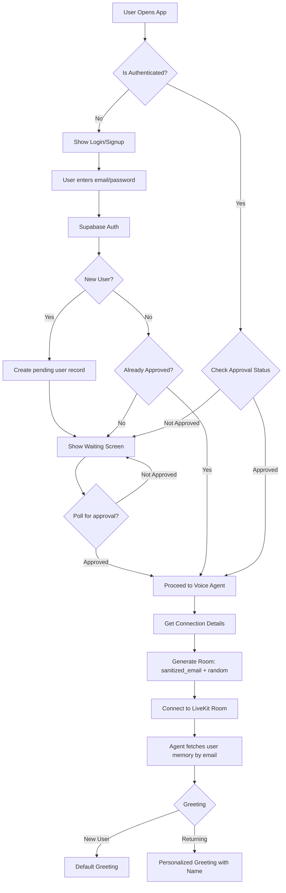

# Authentication Architecture Plan - AI Receptionist

## Overview
This document outlines the architecture for adding Supabase email-based authentication with admin approval workflow to the existing Voice AI Receptionist system.

## Current System State

### Frontend (Next.js)
- **Entry**: [`frontend/agent-starter-react/app/page.tsx`](frontend/agent-starter-react/app/page.tsx)
- **Main App**: [`frontend/agent-starter-react/components/app/app.tsx`](frontend/agent-starter-react/components/app/app.tsx)
- **Welcome View**: [`frontend/agent-starter-react/components/app/welcome-view.tsx`](frontend/agent-starter-react/components/app/welcome-view.tsx)
- **Session View**: [`frontend/agent-starter-react/components/app/session-view.tsx`](frontend/agent-starter-react/components/app/session-view.tsx)
- **Styling**: [`frontend/agent-starter-react/styles/globals.css`](frontend/agent-starter-react/styles/globals.css)

### Backend (Python)
- **Entry Point**: [`main.py`](main.py)
- **Memory Service**: [`memory/service.py`](memory/service.py)
- **Memory Models**: [`memory/models.py`](memory/models.py)
- **Database Connection**: [`database/connection.py`](database/connection.py)

### Connection Details API
- **Route**: [`frontend/agent-starter-react/app/api/connection-details/route.ts`](frontend/agent-starter-react/app/api/connection-details/route.ts:1)
- **Current Room Name**: `voice_assistant_room_${Math.floor(Math.random() * 10_000)}`
- **Current Identity**: `voice_assistant_user_${Math.floor(Math.random() * 10_000)}`

---

## Architecture Diagram



---

## Implementation Plan

### Phase 1: Database Schema Updates

#### Option A: Extend Existing user_memory Table
Modify [`memory/models.py`](memory/models.py:8) to add email-based identity:

```sql
-- Add email column and approval status to existing table
ALTER TABLE user_memory 
ADD COLUMN IF NOT EXISTS email VARCHAR(255) UNIQUE,
ADD COLUMN IF NOT EXISTS is_approved BOOLEAN DEFAULT FALSE,
ADD COLUMN IF NOT EXISTS approved_at TIMESTAMP WITH TIME ZONE;

-- Create index for email lookups
CREATE INDEX IF NOT EXISTS idx_user_memory_email ON user_memory(email);
```

#### Option B: Create New participants Table (Recommended)
Create new table for better separation of concerns:

```sql
CREATE TABLE IF NOT EXISTS participants (
    id UUID PRIMARY KEY DEFAULT gen_random_uuid(),
    email VARCHAR(255) UNIQUE NOT NULL,
    name VARCHAR(128),
    is_approved BOOLEAN DEFAULT FALSE,
    approved_at TIMESTAMP WITH TIME ZONE,
    created_at TIMESTAMP WITH TIME ZONE DEFAULT NOW(),
    updated_at TIMESTAMP WITH TIME ZONE DEFAULT NOW(),
    metadata JSONB DEFAULT '{}'::jsonb
);

-- Link with existing user_memory
CREATE TABLE IF NOT EXISTS participant_memory (
    id UUID PRIMARY KEY DEFAULT gen_random_uuid(),
    participant_id UUID REFERENCES participants(id) ON DELETE CASCADE,
    last_summary TEXT,
    last_call TIMESTAMP WITH TIME ZONE DEFAULT NOW(),
    call_count INTEGER DEFAULT 1,
    created_at TIMESTAMP WITH TIME ZONE DEFAULT NOW(),
    updated_at TIMESTAMP WITH TIME ZONE DEFAULT NOW()
);
```

---

### Phase 2: Frontend Authentication Components

#### 2.1 Auth Context Provider
Create [`frontend/agent-starter-react/components/auth/auth-context.tsx`](frontend/agent-starter-react/components/auth/auth-context.tsx):
- Manage authentication state
- Track user session with Supabase
- Provide `login`, `signup`, `logout`, `checkApproval` functions
- Persist auth state in localStorage

#### 2.2 Login Component
Create [`frontend/agent-starter-react/components/auth/login-form.tsx`](frontend/agent-starter-react/components/auth/login-form.tsx):
- Email input field
- Password input field  
- Submit button
- Error handling display
- Styled with same chat theme (dark/light mode support)

#### 2.3 Signup Component
Create [`frontend/agent-starter-react/components/auth/signup-form.tsx`](frontend/agent-starter-react/components/auth/signup-form.tsx):
- Email input field
- Password input field
- Confirm password field
- Submit button
- Links to login for existing users

#### 2.4 Waiting Screen Component
Create [`frontend/agent-starter-react/components/auth/waiting-screen.tsx`](frontend/agent-starter-react/components/auth/waiting-screen.tsx):
- "You're on the waiting list" message
- Approval status polling (every 10 seconds)
- Logout button
- Same chat theme styling

#### 2.5 Auth Layout
Create wrapper component that maintains consistent theme across auth screens.

---

### Phase 3: Backend API Updates

#### 3.1 Update Connection Details API
Modify [`frontend/agent-starter-react/app/api/connection-details/route.ts`](frontend/agent-starter-react/app/api/connection-details/route.ts:1):

```typescript
// Current (line 40):
const roomName = `voice_assistant_room_${Math.floor(Math.random() * 10_000)}`;

// New:
const userEmail = body?.user_email || '';
const sanitizedEmail = userEmail.replace(/[@.]/g, '').toLowerCase();
const roomName = `${sanitizedEmail}_${Math.floor(Math.random() * 10_000)}`;
const participantIdentity = `${sanitizedEmail}_user_${Math.floor(Math.random() * 10_000)}`;
```

#### 3.2 Create User Registration API
New API endpoint for signup:
- `POST /api/auth/signup`
- Validate email format
- Hash password (or use Supabase Auth)
- Insert into participants table with `is_approved = false`

#### 3.3 Create Approval Check API
New API endpoint:
- `GET /api/auth/status?email=user@email.com`
- Returns approval status

---

### Phase 4: Agent Integration Updates

#### 4.1 Update Agent to Use Email as Identity
Modify [`main.py`](main.py:219):

```python
# Current:
caller_id = participant.identity

# New:
caller_id = participant.identity  # This will now be sanitized email
# Extract email from identity if needed
email = caller_id.split('_user_')[0] if '_user_' in caller_id else caller_id
```

#### 4.2 Update Memory Service
Modify [`memory/models.py`](memory/models.py:40) to support email-based lookups:

```python
FETCH_USER_BY_EMAIL_SQL = """
SELECT phone_number, name, last_summary, last_call, call_count, metadata
FROM user_memory
WHERE email = $1;
"""
```

#### 4.3 Ensure Returning User Greeting Works
The existing [`agents/base.py`](agents/base.py:76) already supports personalized greetings:

```python
# This already works - memory_context is fetched using caller_id
if self.memory_context and self.memory_context.get("name"):
    greeting = self.RETURNING_GREETING_TEMPLATE.format(name=name)
else:
    greeting = self.GREETING_TEMPLATE
```

---

### Phase 5: Environment Configuration

#### Required Environment Variables

**Frontend (.env.local):**
```
NEXT_PUBLIC_SUPABASE_URL=your_supabase_url
NEXT_PUBLIC_SUPABASE_ANON_KEY=your_anon_key
```

**Backend (.env):**
```
DATABASE_URL=postgresql://...
SUPABASE_SERVICE_KEY=your_service_key
```

---

## File Changes Summary

### New Files to Create

| File Path | Purpose |
|-----------|---------|
| `frontend/agent-starter-react/components/auth/auth-context.tsx` | Auth state management |
| `frontend/agent-starter-react/components/auth/login-form.tsx` | Login UI component |
| `frontend/agent-starter-react/components/auth/signup-form.tsx` | Signup UI component |
| `frontend/agent-starter-react/components/auth/waiting-screen.tsx` | Waiting for approval UI |
| `frontend/agent-starter-react/app/api/auth/signup/route.ts` | Signup API endpoint |
| `frontend/agent-starter-react/app/api/auth/status/route.ts` | Approval status endpoint |

### Files to Modify

| File Path | Changes |
|-----------|---------|
| `frontend/agent-starter-react/components/app/app.tsx` | Add auth flow logic |
| `frontend/agent-starter-react/components/app/welcome-view.tsx` | Update for authenticated users |
| `frontend/agent-starter-react/app/api/connection-details/route.ts` | Use email-based room names |
| `memory/models.py` | Add email support |
| `main.py` | Use email for caller identity |

---

## Security Considerations

1. **Password Handling**: Use Supabase Auth for secure password storage
2. **Email Validation**: Validate email format on both frontend and backend
3. **Approval Workflow**: Only approved users can generate LiveKit tokens
4. **Room Isolation**: Each user gets unique room based on sanitized email
5. **Session Expiry**: Implement token refresh logic

---

## Testing Checklist

- [ ] New user can sign up and see waiting screen
- [ ] Admin can approve user in database
- [ ] Approved user can log in and start voice call
- [ ] Room name uses sanitized email format
- [ ] Returning user gets personalized greeting with their name
- [ ] Unapproved user cannot access voice agent
- [ ] Logout clears session properly
- [ ] Dark/light theme works on all auth screens
