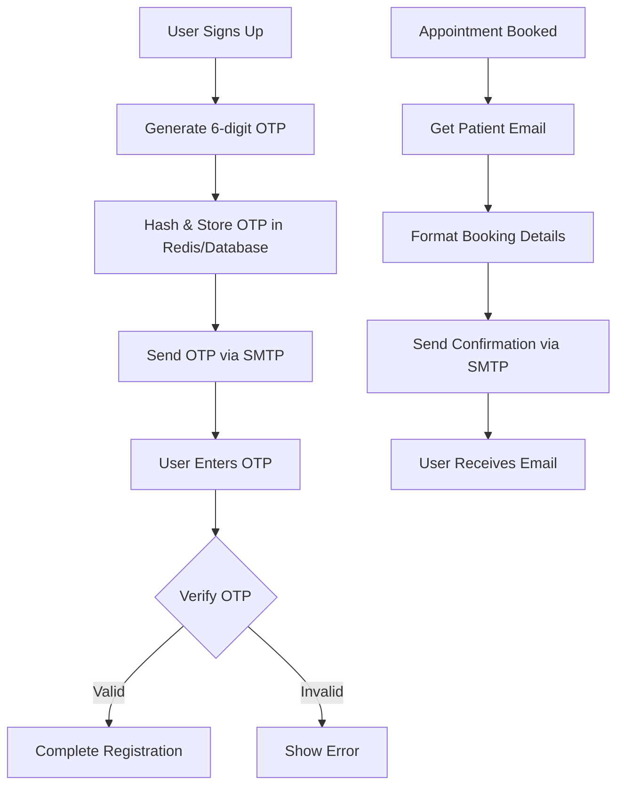

# Email SMTP Architecture Plan

## Overview
This document outlines the architecture for adding email functionality:
1. **OTP Verification** - Send verification codes during signup
2. **Booking Notifications** - Send appointment confirmations to users

---

## Architecture Diagram



---

## Environment Variables Required

```env
# SMTP Configuration
SMTP_HOST=smtp.gmail.com
SMTP_PORT=587
SMTP_USER=your-email@gmail.com
SMTP_PASSWORD=your-app-password
SMTP_FROM=AI Receptionist <your-email@gmail.com>

# For Supabase, you can also use Supabase Auth's built-in email
# NEXT_PUBLIC_SUPABASE_URL=your_supabase_url
# NEXT_PUBLIC_SUPABASE_ANON_KEY=your_anon_key
```

---

## Implementation Plan

### Phase 1: Email Service Backend

#### 1.1 Create Email Service
New file: `tools/email_service.py`

```python
import smtplib
import ssl
import os
from email.mime.text import MIMEText
from email.mime.multipart import MIMEMultipart
import logging

logger = logging.getLogger("email_service")

class EmailService:
    def __init__(self):
        self.smtp_host = os.getenv("SMTP_HOST", "smtp.gmail.com")
        self.smtp_port = int(os.getenv("SMTP_PORT", "587"))
        self.smtp_user = os.getenv("SMTP_USER")
        self.smtp_password = os.getenv("SMTP_PASSWORD")
        self.from_email = os.getenv("SMTP_FROM", self.smtp_user)
    
    def send_email(self, to_email: str, subject: str, html_content: str) -> bool:
        """Send email via SMTP"""
        try:
            msg = MIMEMultipart("alternative")
            msg["Subject"] = subject
            msg["From"] = self.from_email
            msg["To"] = to_email
            
            html_part = MIMEText(html_content, "html")
            msg.attach(html_part)
            
            context = ssl.create_default_context()
            with smtplib.SMTP(self.smtp_host, self.smtp_port) as server:
                server.starttls(context=context)
                server.login(self.smtp_user, self.smtp_password)
                server.sendmail(self.from_email, to_email, msg.as_string())
            
            logger.info(f"Email sent to {to_email}")
            return True
        except Exception as e:
            logger.error(f"Failed to send email: {e}")
            return False
```

#### 1.2 OTP Service
New file: `tools/otp_service.py`

```python
import secrets
import string
import hashlib
import time
from typing import Optional

class OTPService:
    def __init__(self, expiry_seconds: int = 300):  # 5 minutes
        self.expiry_seconds = expiry_seconds
        self.otp_store = {}  # In production, use Redis
    
    def generate_otp(self, email: str) -> str:
        """Generate 6-digit OTP"""
        otp = ''.join(secrets.choice(string.digits) for _ in range(6))
        
        # Hash for storage (don't store plain OTP)
        hashed_otp = hashlib.sha256(otp.encode()).hexdigest()
        
        self.otp_store[email] = {
            "otp": hashed_otp,
            "created_at": time.time(),
            "attempts": 0
        }
        
        return otp
    
    def verify_otp(self, email: str, user_otp: str) -> bool:
        """Verify OTP"""
        if email not in self.otp_store:
            return False
        
        stored = self.otp_store[email]
        
        # Check expiry
        if time.time() - stored["created_at"] > self.expiry_seconds:
            del self.otp_store[email]
            return False
        
        # Check attempts
        if stored["attempts"] >= 3:
            del self.otp_store[email]
            return False
        
        # Verify OTP
        hashed_input = hashlib.sha256(user_otp.encode()).hexdigest()
        if hashed_input == stored["otp"]:
            del self.otp_store[email]  # Clear after successful verification
            return True
        
        stored["attempts"] += 1
        return False
```

---

### Phase 2: Database Updates

#### 2.1 Add OTP Fields to User Memory
Update `memory/models.py`:

```sql
-- Add OTP fields
ALTER TABLE user_memory 
ADD COLUMN IF NOT EXISTS otp_hash VARCHAR(64),
ADD COLUMN IF NOT EXISTS otp_created_at TIMESTAMP WITH TIME ZONE,
ADD COLUMN IF NOT EXISTS is_verified BOOLEAN DEFAULT FALSE;
```

---

### Phase 3: Frontend Updates

#### 3.1 Update Signup Flow
Modify `components/auth/signup-form.tsx`:

1. Add OTP input step after initial signup
2. Show "Verify your email" screen
3. Resend OTP option

#### 3.2 Update Login Flow
- Add option to request password reset via email

---

### Phase 4: Booking Email Notifications

#### 4.1 Update Hospital Agent
Modify `agents/hospital.py`:

```python
@function_tool()
async def send_booking_confirmation(
    self,
    ctx: RunContext,
    patient_email: str,
    doctor_name: str,
    appointment_date: str,
    appointment_time: str
) -> str:
    """Send booking confirmation email"""
    from tools.email_service import EmailService
    
    email_service = EmailService()
    
    html_content = f"""
    <h1>Appointment Confirmed!</h1>
    <p>Dear Patient,</p>
    <p>Your appointment has been successfully booked.</p>
    <ul>
        <li><strong>Doctor:</strong> {doctor_name}</li>
        <li><strong>Date:</strong> {appointment_date}</li>
        <li><strong>Time:</strong> {appointment_time}</li>
    </ul>
    <p>Please arrive 15 minutes before your appointment.</p>
    <p>Thank you for choosing City Health Clinic!</p>
    """
    
    success = email_service.send_email(
        to_email=patient_email,
        subject="Appointment Confirmation - City Health Clinic",
        html_content=html_content
    )
    
    if success:
        return "A confirmation email has been sent to your registered email address."
    else:
        return "Booking confirmed, but we couldn't send the confirmation email. Please check your email later."
```

---

## File Changes Summary

### New Files

| File | Purpose |
|------|---------|
| `tools/email_service.py` | SMTP email sending service |
| `tools/otp_service.py` | OTP generation and verification |

### Files to Modify

| File | Changes |
|------|---------|
| `memory/models.py` | Add OTP fields to schema |
| `agents/hospital.py` | Add email confirmation after booking |
| `frontend/.../signup-form.tsx` | Add OTP verification step |

### Environment Variables

```env
# .env file
SMTP_HOST=smtp.gmail.com
SMTP_PORT=587
SMTP_USER=your-email@gmail.com
SMTP_PASSWORD=your-app-specific-password
SMTP_FROM=AI Receptionist <your-email@gmail.com>
```

---

## Email Templates

### 1. OTP Verification Email
```
Subject: Your Verification Code

Your verification code is: 123456

This code will expire in 5 minutes.

If you didn't request this, please ignore this email.
```

### 2. Booking Confirmation Email
```
Subject: Appointment Confirmed - City Health Clinic

Dear {patient_name},

Your appointment has been confirmed!

Doctor: Dr. {doctor_name}
Date: {date}
Time: {time}

Please arrive 15 minutes before your appointment.

Thank you!
```

---

## Security Considerations

1. **OTP Hashing**: Store hashed OTPs, never plain text
2. **Rate Limiting**: Limit OTP attempts to prevent brute force
3. **Expiry**: OTPs expire after 5 minutes
4. **SMTP Security**: Use TLS/SSL for email transmission
5. **Email Validation**: Validate email format before sending
